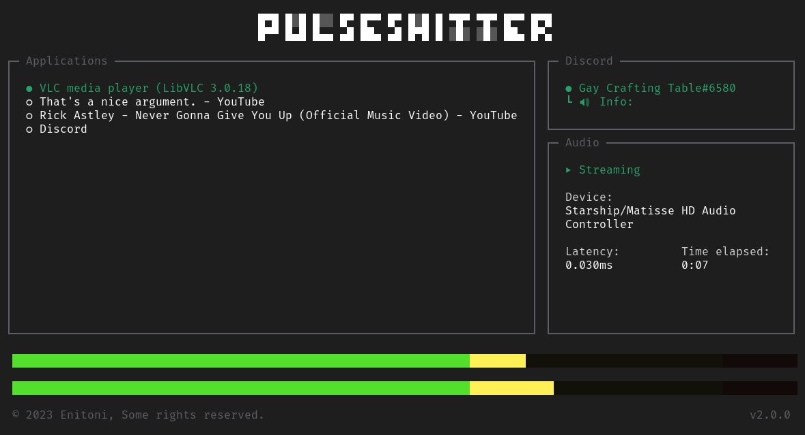

# pulseshitter

[](https://github.com/Enitoni/pulseshitter/blob/main/LICENSE)



pulseshitter is a shitty solution to a shitty problem.

you see, it all started back in 2015, when discord announced discord, an instant messaging social platform for gamers, until they decided that it was for everyone too.

however, they clearly don't support everyone because they hate us blessed linux users. to this day, discord still [doesn't support](https://support.discord.com/hc/en-us/community/posts/360050971374-Linux-Screen-Share-Sound-Support) sharing audio via screen sharing on linux.

## what is this?

this overengineered project is a workaround to make it possible to share audio via a **bot**. ***it does not pipe your audio through your microphone.*** this has two advantages:

- Other people can mute your stream without muting you
- The audio is in pristine 9D quality (stereo)

## features

- shits your audio into a voice channel
- based terminal user interface
- automatically reconnects to an application when parec stops streaming it (it does that a lot)
- cool good sound meter™️
- follows you around so you can always bother your friends
- says fuck you to discord (fuck you discord)
- 🚀 blazingly fa-- 

## caveats

- you need a bot in a server to use it
- linux audio sources are very inconsistent so it's not guaranteed it will reconnect properly, or even show a meaningful name, but you can always just select the app you want to stream again

## usage

### prerequisites

- [linux](https://git.kernel.org/pub/scm/linux/kernel/git/torvalds/linux.git) (duh)
- [pulseaudio](https://www.freedesktop.org/wiki/Software/PulseAudio/) or [pipewire](https://pipewire.org)
- [parec](https://manpages.debian.org/testing/pulseaudio-utils/parec.1.en.html)
- [discord bot](https://google.com/search?q=discord+bot+token+generator)


[download latest release](https://github.com/Enitoni/pulseshitter/releases/latest) and run the binary in your terminal. you can also add it to path for easy access.

```shell
./pulseshitter
```

----

## faq (you)

### Is this a joke?
Parts of this README, yes. The project itself, no. It's actually something I worked really hard on and it is actually a successor to [pulsecord](https://github.com/itsMapleLeaf/pulsecord) which my friend was using. It had some issues, and that's what led to this project.

### Why can't I stream Spotify?
Spotify streaming is disabled by default due to me not wanting to get in trouble for distributing a binary that allows you to bypass the measures Discord has in place to stop you from streaming Spotify through their service.

You can enable it by compiling the project yourself with the `ALLOW_SPOTIFY_STREAMING` environment variable set to `true`.

### Are you open to suggestions/bug reports?
Yes. Please make a GitHub issue if you want to report a bug or suggest a feature.


---

## build

### prerequisites

- [rust](https://www.rust-lang.org/)
- pulseaudio / pipewire
- libopus

compile it by typing this in your terminal:
```shell
cargo build --release
```

then you're done (wow!)


## license

[MPL-2 license](https://www.mozilla.org/en-US/MPL/2.0/) (very original do not steal)
